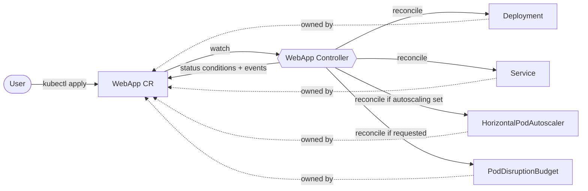

# WebApp Operator

[](https://github.com/Mampiz/webapp-operator/actions/workflows/test.yml)
[](https://github.com/Mampiz/webapp-operator/actions/workflows/lint.yml)
[](https://github.com/Mampiz/webapp-operator/actions/workflows/release.yml)
[](https://github.com/Mampiz/webapp-operator/actions/workflows/security.yml)
[](LICENSE)


A Kubernetes [Operator](https://kubernetes.io/docs/concepts/extend-kubernetes/operator/) written in Go that turns a single high-level `WebApp` resource into a fully managed application stack — a **Deployment**, a **Service**, and optionally a **HorizontalPodAutoscaler** and a **PodDisruptionBudget** — kept continuously in sync with the desired state.

Built with [Kubebuilder](https://book.kubebuilder.io/) and [controller-runtime](https://github.com/kubernetes-sigs/controller-runtime).


📚 **[Documentation](docs/)** — [Getting started](docs/getting-started.md) ·
[Showcase](docs/showcase.md) ·
[Installation](docs/installation.md) · [API reference](docs/api-reference.md) ·
[Admission webhooks](docs/webhooks.md) · [Observability](docs/observability.md) ·
[Troubleshooting](docs/troubleshooting.md) · [Design notes](docs/design.md) ·
[Prior art](docs/prior-art.md) · [Scale](docs/scale.md)

---

## Why?

Deploying even a simple web app on Kubernetes usually means writing and maintaining three or more separate manifests (Deployment, Service, HPA) and keeping them consistent by hand. This operator collapses all of that into one declarative resource:

```yaml
apiVersion: platform.miportfolio.com/v1
kind: WebApp
metadata:
  name: my-api
spec:
  image: my-api:v1.2.3        # explicit tag: "latest" is rejected
  replicas: 2
  port: 8080
  autoscaling:
    minReplicas: 2
    maxReplicas: 10
    cpuThresholdPercent: 70
```

Apply that, and the operator creates and maintains everything else for you.

## Architecture



The controller runs a **level-based reconcile loop**: on every change it compares the desired state (the `WebApp` spec) with the actual cluster state and corrects the difference. It is **idempotent** (running it once or a thousand times yields the same result) and **self-healing** (delete a managed Deployment and it is recreated).

## Features

- **Idempotent reconciliation** via `CreateOrUpdate` — no duplicate resources, no drift.
- **Self-healing** — child resources are owner-referenced; delete one and it comes back.
- **Optional autoscaling** — an HPA is created only when the `autoscaling` block is present.
- **Status reporting** — an `Available` condition reflects real Deployment readiness (`kubectl get webapp` is meaningful).
- **Kubernetes Events** — emitted on meaningful changes, visible in `kubectl describe`.
- **Schema validation** — required fields, numeric ranges, and a cross-field rule (`maxReplicas >= minReplicas`) enforced by the API server before the controller ever runs.
- **Admission webhooks** — a defaulting webhook fills in what makes the resource coherent, and a validating webhook enforces immutable image tags. See [Admission webhooks](#admission-webhooks).
- **Secure by default** — generated pods drop all capabilities, disallow privilege escalation and run under the `RuntimeDefault` seccomp profile, with `runAsNonRoot` / `readOnlyRootFilesystem` available opt-in.
- **Readiness-aware** — a readiness probe is always generated, so `Available` reflects pods that can actually serve.
- **Integration-tested** with [envtest](https://book.kubebuilder.io/reference/envtest.html) against a real API server.

## API reference — `WebApp` spec

| Field | Type | Required | Description |
|---|---|:--:|---|
| `image` | string | ✅ | Container image to run. The tag must be explicit; `latest` and untagged references are rejected (digests are allowed). |
| `replicas` | int32 | ➖ | Desired replicas, defaults to `1`. Ignored when `autoscaling` is set — the HPA owns the count. |
| `port` | int32 | ✅ | Container port the app listens on (1–65535). |
| `readinessPath` | string | ➖ | HTTP path probed for readiness on `port`. Defaults to a TCP check on `port`. |
| `resources` | object | ➖ | Standard `requests`/`limits` for the container. A CPU request is injected when autoscaling is on and none is given. |
| `autoscaling` | object | ➖ | Enables a HorizontalPodAutoscaler. |
| `autoscaling.minReplicas` | int32 | ✅¹ | Minimum replicas (≥ 1). |
| `autoscaling.maxReplicas` | int32 | ✅¹ | Maximum replicas (≥ 1, and ≥ `minReplicas`). |
| `autoscaling.cpuThresholdPercent` | int32 | ✅¹ | Target average CPU utilization (1–100), as a percentage of the CPU **request**. |
| `security.runAsNonRoot` | bool | ➖ | Refuse to start if the image would run as root. Requires an image with a non-root `USER`. |
| `security.runAsUser` | int64 | ➖ | UID to run the container as. |
| `security.readOnlyRootFilesystem` | bool | ➖ | Mount the container root filesystem read-only. |
| `podDisruptionBudget` | object | ➖ | Creates a PodDisruptionBudget. Exactly one of `minAvailable` / `maxUnavailable`. |

¹ Required only when the `autoscaling` block is present.

> Because all capabilities are dropped, containers cannot bind privileged ports
> (< 1024) — that needs `CAP_NET_BIND_SERVICE`. Use a port such as 8080.

### Status

| Field | Description |
|---|---|
| `readyReplicas` | Pods currently ready behind the WebApp. |
| `observedGeneration` | The `metadata.generation` the status was computed from. |
| `conditions[Available]` | `True` when the desired replicas are ready. |
| `conditions[Progressing]` | `True` while the Deployment is rolling out. |
| `conditions[Degraded]` | `True` when reconciliation failed; the message carries the cause. |

```console
$ kubectl get webapp
NAME            IMAGE                                     READY   AVAILABLE   AGE
webapp-sample   nginxinc/nginx-unprivileged:1.27-alpine   2       True        3m40s
```

## Admission webhooks

The operator registers two webhooks, which is where its platform policy lives.

**Defaulting (mutating)** — makes a submitted `WebApp` coherent before it is stored:
- stamps `app.kubernetes.io/managed-by=webapp-operator` when absent;
- defaults `replicas` to 1;
- injects a `100m` CPU request when `autoscaling` is set and no request was given —
  HPA target utilization is a percentage of the request, so without one the
  autoscaler reports `<unknown>` and never scales.

**Validating** — rejects image references that are not reproducible:

```console
$ kubectl apply -f config/samples/platform_v1_webapp_invalid.yaml
Error from server (Forbidden): admission webhook "vwebapp-v1.kb.io" denied the request:
spec.image "nginx:latest" uses the mutable "latest" tag; pin an explicit version for reproducibility
```

The reasoning is a platform one: a mutable tag means the same spec can silently
run different code tomorrow, so a rollback is not guaranteed to restore the
previous behaviour. Explicit tags and `@sha256:` digests are accepted.

Webhooks serve over TLS, so they need certificates from
[cert-manager](https://cert-manager.io/) when deployed to a real cluster. They
are tested against a real API server with envtest, and the Helm chart ships them
disabled (`webhook.enable=false`) so the chart installs without cert-manager.

## Installation

### Prerequisites

- A Kubernetes cluster (a local [kind](https://kind.sigs.k8s.io/) cluster works great).
- `kubectl` configured to talk to it.
- [cert-manager](https://cert-manager.io/) **only if you want the admission webhooks**;
  everything else works without it.

Install a **tagged release**, never `main` — the manifests in `main` track
unreleased work and reference an image that may not exist yet.

### Option A — single manifest

Two artifacts ship with every release:

```bash
# Any cluster — no cert-manager required
kubectl apply -f https://github.com/Mampiz/webapp-operator/releases/download/v1.0.0/install.yaml

# With the admission webhooks — install cert-manager first
kubectl apply -f https://github.com/Mampiz/webapp-operator/releases/download/v1.0.0/install-with-webhooks.yaml
```

Without the webhooks the operator still reconciles correctly — schema defaults
come from the API server and the reconciler applies the autoscaling CPU request
itself. What is lost is the image-tag **policy**. See
[Installation](docs/installation.md#what-you-give-up-without-the-webhooks).

### Option B — Helm

```bash
helm install webapp-operator \
  oci://ghcr.io/mampiz/charts/webapp-operator --version 1.0.0 \
  --namespace webapp-operator-system --create-namespace

# opt in to webhooks (needs cert-manager) and to the ServiceMonitor + alerts
helm install webapp-operator oci://ghcr.io/mampiz/charts/webapp-operator \
  --set webhook.enable=true --set certManager.enabled=true \
  --set prometheus.enabled=true
```

All install paths bring the CRD, RBAC, and the operator Deployment.

### Supported Kubernetes versions

| Component | Version |
|---|---|
| Kubernetes | 1.29 – 1.36 |
| Go (build) | 1.26 |
| controller-runtime | v0.24 |
| cert-manager (webhooks only) | ≥ 1.14 |

The floor is 1.29, the first release where the `autoscaling/v2` and `policy/v1`
APIs used here are broadly available alongside CEL validation rules in CRDs.
CI exercises the version bundled with envtest (1.36).

## Quick start

The fastest path is the scripted walkthrough — it creates a kind cluster,
installs the operator, demonstrates self-healing and shows the webhook rejecting
a mutable tag:

```bash
make demo
```

Or step by step:

```bash
# 1. Spin up a local cluster and install the operator
kind create cluster --name webapp-dev
make install deploy IMG=ghcr.io/mampiz/webapp-operator:1.0.0

# 2. Create a WebApp
kubectl apply -f config/samples/platform_v1_webapp.yaml

# 3. Watch the operator create everything
kubectl get webapp
kubectl get deployment,service,hpa,pdb
```

Expected output:

```text
NAME            IMAGE                                     READY   AVAILABLE   AGE
webapp-sample   nginxinc/nginx-unprivileged:1.27-alpine   2       True        3m40s

NAME                                    READY   UP-TO-DATE   AVAILABLE   AGE
deployment.apps/webapp-sample-deployment   2/2     2            2         3m40s

NAME                            TYPE        CLUSTER-IP     PORT(S)    AGE
service/webapp-sample-service   ClusterIP   10.96.59.187   8080/TCP   3m40s

NAME                                                        REFERENCE                             MINPODS   MAXPODS   AGE
horizontalpodautoscaler.autoscaling/webapp-sample-autoscaler   Deployment/webapp-sample-deployment   2       10        3m40s

NAME                            MIN AVAILABLE   ALLOWED DISRUPTIONS   AGE
poddisruptionbudget.policy/webapp-sample-pdb   1     1                3m40s
```

The status reports what the operator actually observed:

```console
$ kubectl get webapp webapp-sample -o jsonpath='{range .status.conditions[*]}{.type}={.status} ({.reason}){"\n"}{end}'
Available=True (DeploymentReady)
Progressing=False (RolloutComplete)
Degraded=False (ReconcileSucceeded)
```

**Self-healing** — delete the Deployment and the operator recreates it:

```console
$ kubectl delete deployment webapp-sample-deployment
deployment.apps "webapp-sample-deployment" deleted
$ kubectl get deployment            # already back, recreated by the operator
NAME                       READY   UP-TO-DATE   AVAILABLE   AGE
webapp-sample-deployment   2/2     2            2           1s
```

**Validation** — invalid specs are rejected by the API server *before* the controller runs:

```console
$ kubectl apply -f webapp-bad.yaml     # cpuThresholdPercent: 150
The WebApp "bad" is invalid: spec.autoscaling.cpuThresholdPercent: Invalid value: 150:
spec.autoscaling.cpuThresholdPercent in body should be less than or equal to 100
```

## Capability levels

Self-assessment against the [Operator Framework capability
levels](https://sdk.operatorframework.io/docs/overview/operator-capabilities/).

| Level | Status | Notes |
|---|:--:|---|
| **1 — Basic Install** | ✅ | Installs the operand from a single resource: Deployment, Service, optional HPA and PDB, with schema + admission validation. |
| **2 — Seamless Upgrades** | 🟡 | Operand upgrades work: changing `spec.image` triggers a rolling update the controller drives. Operator upgrades are versioned and released, but there is a single API version, so no conversion story has been exercised. |
| **3 — Full Lifecycle** | ➖ N/A | The operand is a **stateless** web application: there are no backups, restores or storage migrations to perform. Deletion is handled by owner references, and there is no external state that would need finalizers. Marked N/A rather than missing. |
| **4 — Deep Insights** | ✅ | Metrics for both the operator (`webapp_reconcile_total`, `webapp_child_operations_total`) and the operand (`webapp_ready_replicas`, `webapp_info`), a Grafana dashboard, alerting rules, Kubernetes events, and `Available`/`Progressing`/`Degraded` conditions with `observedGeneration`. |
| **5 — Auto Pilot** | 🟡 | Horizontal auto-scaling is delegated to an HPA the operator configures, and the reconcile self-heals drift. There is no automated tuning, anomaly detection or workload-driven remediation. |

Roadmap for the partial levels: exercise a `v1alpha1 → v1` conversion webhook
(level 2), and add request-rate-based scaling via custom metrics (level 5).

## Scale

Measured on a single-node kind cluster, not estimated
([methodology](docs/scale.md)):

| WebApps | Reconcile p50 | p95 | Peak queue depth | Manager RSS |
|--:|--:|--:|--:|--:|
| 100 | 25 ms | 50 ms | 1 | 34 MB |
| 250 | 25 ms | 50 ms | 1 | 41 MB |

Per-object reconcile cost is flat — the work per reconciliation does not depend
on how many objects exist — and memory grows linearly with the watched set at
roughly 45 KB per WebApp. Reproduce with `make scale-test`.

## Observability

The operator exposes Prometheus metrics on the manager's `/metrics` endpoint, including custom domain metrics:

Metrics cover **both the operator and the operand**, which is what level 4
(Deep Insights) asks for:

| Metric | Type | Labels | Meaning |
|---|---|---|---|
| `webapp_reconcile_total` | counter | `result` | Reconciles, by outcome (`success` / `error`) |
| `webapp_child_operations_total` | counter | `resource`, `operation` | Create/update operations on managed children |
| `webapp_ready_replicas` | gauge | `namespace`, `name` | Pods currently ready behind each WebApp |
| `webapp_info` | gauge | `namespace`, `name`, `image` | Always 1; carries the running image for joins |

…plus the standard controller-runtime metrics (reconcile latency, work-queue depth, …).

Series for a deleted `WebApp` are removed on the reconcile that observes the
deletion, so dashboards do not keep showing objects that no longer exist.

Scraping is wired through the `ServiceMonitor` in `config/prometheus/` (for the Prometheus Operator), alongside a [`PrometheusRule`](config/prometheus/alerts.yaml) with alerts for sustained reconcile failures, WebApps stuck without ready replicas, and a backing-up work queue. A ready-made Grafana dashboard lives at [`config/grafana/webapp-operator-dashboard.json`](config/grafana/webapp-operator-dashboard.json) — import it and select your Prometheus data source.


## Development

```bash
make manifests generate   # regenerate CRD + deepcopy code after editing api/
make run                  # run the operator locally against the current cluster
make test                 # run the envtest integration suite
make build-installer IMG=<your-image>   # regenerate dist/install.yaml
make demo                 # scripted end-to-end walkthrough on a fresh kind cluster
make docs-media           # regenerate the GIF and screenshots under docs/assets
```

Design decisions and their trade-offs are written up in
[`docs/design.md`](docs/design.md); release history is in
[`CHANGELOG.md`](CHANGELOG.md). The images in the docs are generated, not
hand-captured — see [`docs/media.md`](docs/media.md).

The core reconcile logic lives in [`internal/controller/webapp_controller.go`](internal/controller/webapp_controller.go); the API types in [`api/v1/webapp_types.go`](api/v1/webapp_types.go).

## License

Apache 2.0. See [LICENSE](LICENSE).
