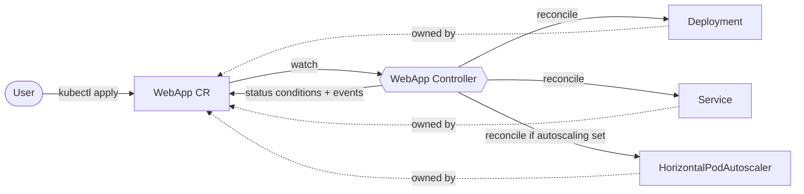
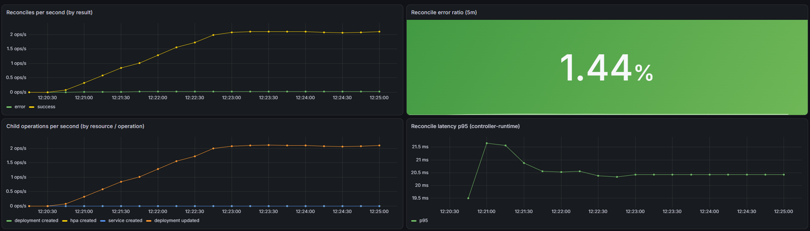

# WebApp Operator

[](https://github.com/Mampiz/webapp-operator/actions/workflows/test.yml)
[](https://github.com/Mampiz/webapp-operator/actions/workflows/lint.yml)
[](https://github.com/Mampiz/webapp-operator/actions/workflows/release.yml)
[](LICENSE)


A Kubernetes [Operator](https://kubernetes.io/docs/concepts/extend-kubernetes/operator/) written in Go that turns a single high-level `WebApp` resource into a fully managed application stack — a **Deployment**, a **Service**, and an optional **HorizontalPodAutoscaler** — kept continuously in sync with the desired state.

Built with [Kubebuilder](https://book.kubebuilder.io/) and [controller-runtime](https://github.com/kubernetes-sigs/controller-runtime).

---

## Why?

Deploying even a simple web app on Kubernetes usually means writing and maintaining three or more separate manifests (Deployment, Service, HPA) and keeping them consistent by hand. This operator collapses all of that into one declarative resource:

```yaml
apiVersion: platform.miportfolio.com/v1
kind: WebApp
metadata:
  name: my-api
spec:
  image: my-api:v1.2.3
  replicas: 2
  port: 8080
  autoscaling:
    minReplicas: 2
    maxReplicas: 10
    cpuThresholdPercent: 70
```

Apply that, and the operator creates and maintains everything else for you.

## Architecture



The controller runs a **level-based reconcile loop**: on every change it compares the desired state (the `WebApp` spec) with the actual cluster state and corrects the difference. It is **idempotent** (running it once or a thousand times yields the same result) and **self-healing** (delete a managed Deployment and it is recreated).

## Features

- **Idempotent reconciliation** via `CreateOrUpdate` — no duplicate resources, no drift.
- **Self-healing** — child resources are owner-referenced; delete one and it comes back.
- **Optional autoscaling** — an HPA is created only when the `autoscaling` block is present.
- **Status reporting** — an `Available` condition reflects real Deployment readiness (`kubectl get webapp` is meaningful).
- **Kubernetes Events** — emitted on meaningful changes, visible in `kubectl describe`.
- **Schema validation** — required fields, numeric ranges, and a cross-field rule (`maxReplicas >= minReplicas`) enforced by the API server before the controller ever runs.
- **Integration-tested** with [envtest](https://book.kubebuilder.io/reference/envtest.html) against a real API server.

## API reference — `WebApp` spec

| Field | Type | Required | Description |
|---|---|:--:|---|
| `image` | string | ✅ | Container image to run. |
| `replicas` | int32 | ✅ | Desired replicas (ignored when `autoscaling` is set — the HPA owns the count). |
| `port` | int32 | ✅ | Container port the app listens on. |
| `autoscaling` | object | ➖ | Optional autoscaling configuration. |
| `autoscaling.minReplicas` | int32 | ✅¹ | Minimum replicas (≥ 1). |
| `autoscaling.maxReplicas` | int32 | ✅¹ | Maximum replicas (≥ 1, and ≥ `minReplicas`). |
| `autoscaling.cpuThresholdPercent` | int32 | ✅¹ | Target average CPU utilization, 1–100. |

¹ Required only when the `autoscaling` block is present.

The `status` reports an `Available` condition (`True`/`False`) with a human-readable message such as `3/3 replicas ready`.

## Installation

### Prerequisites

- A Kubernetes cluster (a local [kind](https://kind.sigs.k8s.io/) cluster works great).
- `kubectl` configured to talk to it.

### Option A — single manifest

```bash
kubectl apply -f https://raw.githubusercontent.com/Mampiz/webapp-operator/main/dist/install.yaml
```

### Option B — Helm

```bash
helm install webapp-operator ./dist/chart
```

Both install the CRD, RBAC, and the operator Deployment.

## Quick start / demo

```bash
# 1. Spin up a local cluster and install the operator
kind create cluster --name webapp-dev
kubectl apply -f dist/install.yaml

# 2. Create a WebApp
kubectl apply -f - <<'EOF'
apiVersion: platform.miportfolio.com/v1
kind: WebApp
metadata:
  name: my-api
spec:
  image: nginx:latest
  replicas: 2
  port: 80
  autoscaling:
    minReplicas: 2
    maxReplicas: 10
    cpuThresholdPercent: 70
EOF

# 3. Watch the operator create everything
kubectl get deployment,service,hpa
```

Expected output:

```text
NAME                                       READY   UP-TO-DATE   AVAILABLE   AGE
deployment.apps/my-api-deployment          2/2     2            2           8s

NAME                     TYPE        CLUSTER-IP     PORT(S)   AGE
service/my-api-service   ClusterIP   10.96.90.19    80/TCP    8s

NAME                                                    REFERENCE                      MINPODS   MAXPODS   AGE
horizontalpodautoscaler.autoscaling/my-api-autoscaler   Deployment/my-api-deployment   2         10        8s
```

The `WebApp` status reports readiness as a condition:

```console
$ kubectl get webapp my-api -o jsonpath='{.status.conditions[0]}'
{"type":"Available","status":"True","reason":"DeploymentReady","message":"all replicas are ready"}
```

**Self-healing** — delete the Deployment and the operator recreates it:

```console
$ kubectl delete deployment my-api-deployment
deployment.apps "my-api-deployment" deleted
$ kubectl get deployment            # already back, recreated by the operator
NAME                READY   UP-TO-DATE   AVAILABLE   AGE
my-api-deployment   2/2     2            2           1s
```

**Validation** — invalid specs are rejected by the API server *before* the controller runs:

```console
$ kubectl apply -f webapp-bad.yaml     # cpuThresholdPercent: 150
The WebApp "bad" is invalid: spec.autoscaling.cpuThresholdPercent: Invalid value: 150:
spec.autoscaling.cpuThresholdPercent in body should be less than or equal to 100
```

## Observability

The operator exposes Prometheus metrics on the manager's `/metrics` endpoint, including custom domain metrics:

| Metric | Type | Labels | Meaning |
|---|---|---|---|
| `webapp_reconcile_total` | counter | `result` | Reconciles, by outcome (`success` / `error`) |
| `webapp_child_operations_total` | counter | `resource`, `operation` | Create/update operations on managed Deployments, Services and HPAs |

…plus the standard controller-runtime metrics (reconcile latency, work-queue depth, …).

Scraping is wired through the `ServiceMonitor` in `config/prometheus/` (for the Prometheus Operator). A ready-made Grafana dashboard lives at [`config/grafana/webapp-operator-dashboard.json`](config/grafana/webapp-operator-dashboard.json) — import it and select your Prometheus data source.



<!-- Add docs/grafana.png: a screenshot of the imported dashboard once Prometheus + Grafana are scraping the operator (e.g. via the kube-prometheus-stack Helm chart). This is the one visual where a screenshot beats text. -->

## Development

```bash
make manifests generate   # regenerate CRD + deepcopy code after editing api/
make run                  # run the operator locally against the current cluster
make test                 # run the envtest integration suite
make build-installer IMG=<your-image>   # regenerate dist/install.yaml
```

The core reconcile logic lives in [`internal/controller/webapp_controller.go`](internal/controller/webapp_controller.go); the API types in [`api/v1/webapp_types.go`](api/v1/webapp_types.go).

## License

Apache 2.0. See [LICENSE](LICENSE).
