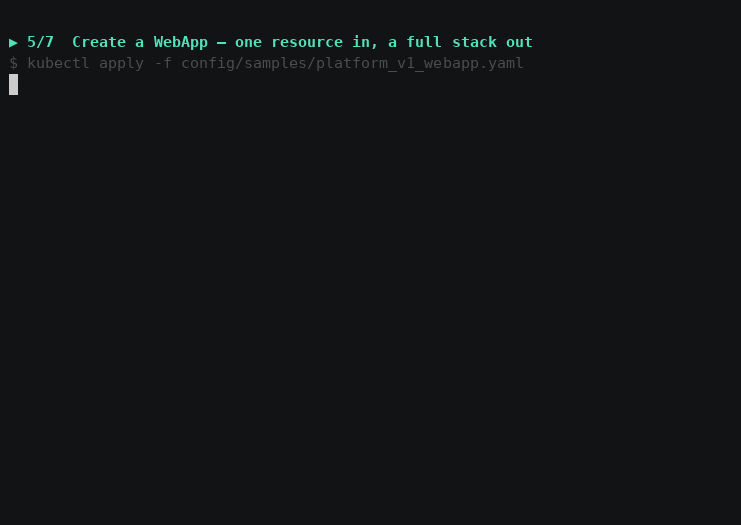

# WebApp Operator — documentation

A Kubernetes operator that turns a single `WebApp` resource into a managed
application stack: a Deployment, a Service, and optionally a
HorizontalPodAutoscaler and a PodDisruptionBudget.



## Contents

| Document | What it covers |
|---|---|
| [Getting started](getting-started.md) | Install the operator on a local cluster and deploy your first `WebApp`. |
| [Showcase](showcase.md) | What it does that plain manifests cannot: drift correction, self-healing, admission control, honest status — with real transcripts. |
| [Installation](installation.md) | Production install: manifest or Helm, webhook setup with cert-manager, upgrades, uninstall. |
| [API reference](api-reference.md) | Every field of `spec` and `status`, with validation rules and defaults. |
| [Admission webhooks](webhooks.md) | The defaulting and validation policy, and how to run it. |
| [Observability](observability.md) | Metrics, the Grafana dashboard, alerting rules and events. |
| [Troubleshooting](troubleshooting.md) | Symptom-driven guide to the failures you are most likely to hit. |
| [Design notes](design.md) | Why the operator behaves the way it does, and the trade-offs taken. |
| [Prior art](prior-art.md) | Honest comparison with Helm charts, kro and Knative — including when *not* to use this. |
| [Scale](scale.md) | Measured behaviour as the number of WebApps grows. |
| [Recording the media](media.md) | How the GIF and screenshots in these docs are generated. |

## At a glance

```yaml
apiVersion: platform.miportfolio.com/v1
kind: WebApp
metadata:
  name: my-api
spec:
  image: my-api:v1.2.3
  port: 8080
  replicas: 2
  autoscaling:
    minReplicas: 2
    maxReplicas: 10
    cpuThresholdPercent: 70
```

```console
$ kubectl get webapp
NAME     IMAGE           READY   AVAILABLE   AGE
my-api   my-api:v1.2.3   2       True        45s
```

## Supported versions

| Component | Version |
|---|---|
| Kubernetes | 1.29 – 1.36 |
| Go (build) | 1.26 |
| controller-runtime | v0.24 |
| cert-manager (webhooks only) | ≥ 1.14 |

Kubernetes 1.29 is the floor: it is the first release where `autoscaling/v2`,
`policy/v1` and CEL validation rules in CRDs are all broadly available.
